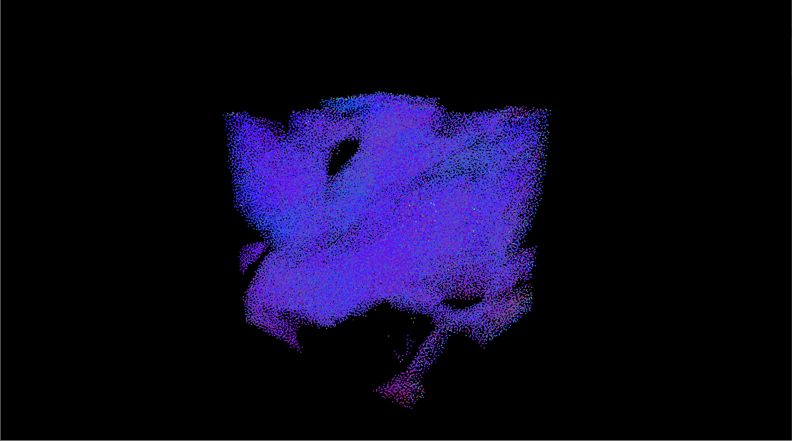
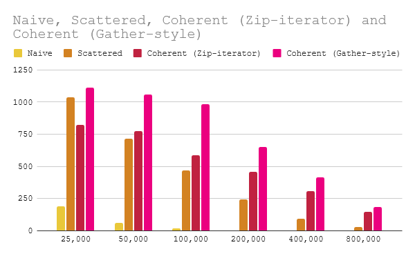
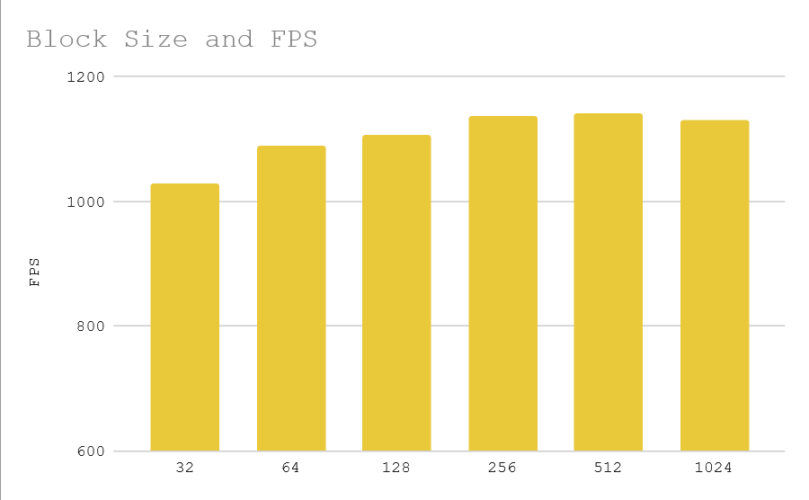
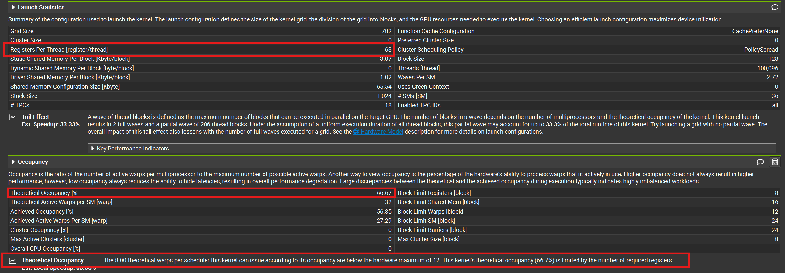
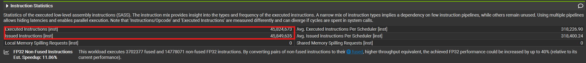
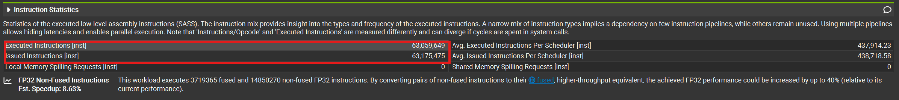

**University of Pennsylvania, CIS 5650: GPU Programming and Architecture,
Project 1 - Flocking**

* T Fong
  * [LinkedIn](https://www.linkedin.com/in/tzfong/), [personal website](https://www.tzfong.com/)
* Tested on: Windows 11, Intel Ultra9 275HX (2.70 GHz), RTX 5070 Mobile, 32 GB RAM (5600 MT/s)



### What's a boid?
[Boids](https://en.wikipedia.org/wiki/Boids) are bird-like particles developed by Craig Reynolds in 1986. They're bird-like in that they exhibit flocking behavior by following 3 rules:  
* Cohesion: boids move towards a local center of mass.
* Separation: boids try to keep a distance from neighboring boids.
* Alignment: boids try to match the velocities of neighboring boids.

These are labeled rules 1, 2, and 3 respectively in my implementation, and the concept of "local" and "neighboring" is controlled by the radii `rule1Distance`, `rule2Distance`, and `rule3Distance`.

Here's some pseudocode for the computation of the rules that I didn't write:

```
function rule1(Boid boid)

    Vector perceived_center

    foreach Boid b:
        if b != boid and distance(b, boid) < rule1Distance then
            perceived_center += b.position
        endif
    end

    perceived_center /= number_of_neighbors

    return (perceived_center - boid.position) * rule1Scale
end
```
```
function rule2(Boid boid)

    Vector c = 0

    foreach Boid b
        if b != boid and distance(b, boid) < rule2Distance then
            c -= (b.position - boid.position)
        endif
    end

    return c * rule2Scale
end
```
```
function rule3(Boid boid)

    Vector perceived_velocity

    foreach Boid b
        if b != boid and distance(b, boid) < rule3Distance then
            perceived_velocity += b.velocity
        endif
    end

    perceived_velocity /= number_of_neighbors

    return perceived_velocity * rule3Scale
end
```
We compute the new velocity by adding the sum of the rules to our existing velocity.

Also technically, the computation of rule three should subtract the boid's own velocity.

### Naïve simulation (brute force)
In implementation, at each time step, each boid will examine the positions and velocities of other boids at the previous time step, and update its own velocity according to the rules outlined above. We then update the positions of all the boids by moving it according to its current velocity. This is pretty clearly quite parallelizable, and therefore something that can be accelerated on the GPU.

We'll start with 3 buffers on the GPU, `pos`, `vel1`, and `vel2`. `vel1` represents the velocities of the boids at the previous time step, which we read from, and `vel2` represents the velocities of the boids at the current time step. We then swap `vel2` and `vel1`, called "ping-ponging", because the current `vel2` becomes the next iteration's `vel1`.

It's easy to get a naïve simulation up and running; each boid iterates over all other boids (in my testing, I mostly stuck with 100,000 boids). This is wasteful, because most of the boids will (likely) not be within the radius of the rules, but not incorrect.

### Using a spatial grid
We can get a much better result by iterating over a narrower number of boids that are more likely to be neighbors. By dividing the simulation space into a spatial grid, we can iterate over the grid cells that are within the radius of one of the rules of our boid.

We can create `thrust::device_ptr`s of our `dev_particleGridIndices` and `dev_particleArrayIndices` buffers, which store the grid cells and the place within the position and velocity buffers of our boids, respectively. Then, we call `thrust::sort_by_key` to sort the latter with respect to the former. By using a separate kernel to identify where in `dev_particleGridIndices` grid cells start and end, we can iterate over the boids of a specific grid cell (with an extra layer of indirection needed to actually access the positions and velocities).

### Semi-coherent memory access in the spatial grid
We can further optimize performance by making our memory reads semi-coherent. Instead of chasing pointers to unsorted position and velocity buffers, we sort them. There are two different ways I went about this, and I was very surprised by the results, which I'll cover in a second.

#### Zip-iterators
At least to me, it was conceptually easiest to improve upon the previous approach by using `pos`, `vel1` as the values, rather than `particleArrayIndices`. Thrust provides a way to do this: after wrapping `pos`, `vel1` into device pointers, we can wrap them into a `thrust::zip_iterator`, and use that as the value for the unstable sort.

#### Gather
Alternatively, we can sort `particleArrayIndices`, then add the extra step of shuffling `pos`, `vel1` to match that. Thrust also provides an implementation of this idea, which as you may have guessed, is called `thrust::gather`. I only learned about that after I had already made my own kernel implementing it, which from a very limited amount of testing seemed to about the same to a little better than the 2 calls to `thrust::gather` I would need to shuffled `pos`, `vel1`, so I used my kernel when benchmarking. Neither does the shuffle in-place, though, so I allocated a new `pos2` buffer to shuffle `pos` into.

Let's take a look at the numbers now. As a fun exercise, take a guess of how you think the approaches stack up.

### A note about benchmarking
Fps benchmarks were done by taking the average fps over a window of `seconds = 20` on my laptop's maximum performance setting. I noticed that there tended to be a spike at the beginning of execution, so I included a `warmup = 2`.

Since all of the benchmarks use fps as the y metric, higher is better.

### Comparing the four methods outlined earlier
Here's an fps performance comparison between the four methods I outlined earlier. Note that the cell width was set to `2 * maxRuleDistance`, and the block size was set to 128. We'll check out the effects of varying the cell width later.


Here are the same benchmarks, but with visualization turned on.


I was most surprised by the difference in performance between using zip iterators and using a gather-style kernel. In fact, using a zip iterator causes the semi-coherent version to perform *worse* at lower boid counts! I would assume it's due to the much higher overhead of shuffling around 2 `vec3`s at 24 bytes instead of 1 `int` at 4 bytes.

### Testing out different grid cell sizes
In my original implemention of the scattered spatial grid and the semi-coherent spatial grid, I used the logic below to compute the $\leq$ 8 grid cells you would need to check (given cell width is `2 * maxRuleDistance`):

```
 glm::vec3 gridCell = (pos[idx] - gridMin) * inverseCellWidth;
 glm::ivec3 hi = glm::round(gridCell);
 glm::ivec3 lo = hi - glm::ivec3(1);
```

The idea was to take the float of the grid cell our boid resides in, then find the nearest bottom corner of a grid cell. That grid cell would be the highest grid cell in the 2 * 2 * 2 neighborhood of grid cells we would check (I opted to ignore the case where one of the coordinates was exactly .5 given the unlikeliness of it), and if we subtracted `ivec3(1)` we'd get the lowest grid cell in the neighborhood to check.

In order to allow for flexible grid sizes, I later used this logic to compute the grid cells you would need to check given an arbitrary cell width:

```
glm::ivec3 lo = glm::floor(glm::max(glm::vec3(0), gridCell - maxRuleDistance / cellWidth));
glm::ivec3 hi = glm::floor(glm::min(glm::vec3(gridResolution - 1), gridCell + maxRuleDistance / cellWidth));
```
which computes the maximum bounding box in which reachable grid cells could reside. Now within the loop, we check if the grid cell is reachable (because our bounding box was generous):

```
                    glm::vec3 cellMin = cellWidth * glm::vec3(i, j, k) + gridMin;
                    glm::vec3 cellMax = cellWidth * glm::vec3(i + 1, j + 1, k + 1) + gridMin;
                    glm::vec3 closest = glm::clamp(posSelf, cellMin, cellMax);
                    if (glm::length(closest - posSelf) > maxRuleDistance) continue;
```

Here's a graph showing how fps is affected by the cell width at different boid counts. We observe that a cell width of $1$ times the maximum rule distance maximizes the fps. There's more overhead in finding the start and end points of grid cells because the number of grid cells grows with the inverse of the cube of the grid cell width, but we also decrease the number of boids we need to iterate over with a smaller grid cell width.


### Block sizes
Occupancy can affect performance, so it's worth varying the block size to see how that changes things.

This whole time I've been using `kernUpdateVelNeighborSearchCoherentGridLoopOptimization`, which uses 52 registers per thread. My RTX 5070 Laptop has a maximum of 1536 threads per SM, 24 blocks per SM, and 36 SMs.

To not get throttled by the blocks per SM limit, I'd want at least $1536 / 24 = 64$ threads per block. And to not get throttled by the registers per thread, I think I'd want at most $65536 / 1536 = 42.667 \approx 42$ registers per thread.

So I thought it'd make sense for 64 to be the sweet spot for occupancy. Even though my registers per thread is not ideal, I'd at least be able to fit as many blocks as possible on each SM given the circumstances.

So the results surprised me. Given 200K boids with a cell width of `2 * maxRuleDistance`, I got:



Performance maxed out at 512 threads per block.

### Using shared memory (naïvely)
Another potential bottleneck is the large amount of reads we're doing from global memory. Some of that is probably cached since adjacent threads are more likely to also be adjacent in space, but we can try optimizing this a bit by putting as many boids as we can into shared memory.

Here's my shared memory caches:
```
    __shared__ glm::vec3 sPos[blockSize];
    __shared__ glm::vec3 sVel1[blockSize];

    ...

    if (idx < N) {
        sPos[threadIdx.x] = posSelf;
        sVel1[threadIdx.x] = vel1[idx];
    }
```

Then while iterating over the neighboring boids, I check if the thread responsible for the other boid is in the block with the following code, where `pIdx` is the index of the other boid (and its thread):
```
    glm::vec3 pPos = (pIdx >= blockIdx.x * blockDim.x && pIdx < (blockIdx.x + 1) * blockDim.x) ?
        sPos[pIdx - blockIdx.x * blockDim.x] : 
        pos[pIdx];
    
    glm::vec3 pVel = (pIdx >= blockIdx.x * blockDim.x && pIdx < (blockIdx.x + 1) * blockDim.x) ?
        sVel1[pIdx - blockIdx.x * blockDim.x] : 
        vel1[pIdx];
```
Is it the best way of going about using shared memory? No. I am hoping that the neighboring threads' boids are close by, which may not be a good assumption given the way the grid cells are numbered. Given more time, I would actually have liked to experiment with using something like a Z-order curve instead.

It might not be too surprising therefore, that this shared memory usage didn't contribute much to performance. What actually surprised me though was that it detracted a good amount from performance in initial testing.

When profiling, Saahil pointed out that register use might be an issue, and taking a look, we see:




Register use jumps from 48 to 63, and NSight warns us that occupancy gets decreased. I went back to my code and scoped some of the code for shared memory out, reducing the registers for shared memory to 52, and when I went back to benchmark, here are the results:


Yeah, unfortunately, at every configuration I tested (including some not listed here), shared memory underperformed compared to not using shared memory. I'm not entirely sure if this is the cause, but comparing the profiles of the updated versions, the shared memory version (bottom) executed significantly more instructions.




### Blooper (singular)
I would put more bloopers here, but I kind of only have the one funny looking one. I was implementing one of the optimizations and noticed my FPS tanked as a result. I turned on visualization to see that would give me an idea of what was going on and was greeted by **the cube**.


Dunno what the cause was, but since the boids are much more densely packed together (especially at the edges of **the cube**), you'd see why performance would degrade, as each boid would be iterating over way more boids.